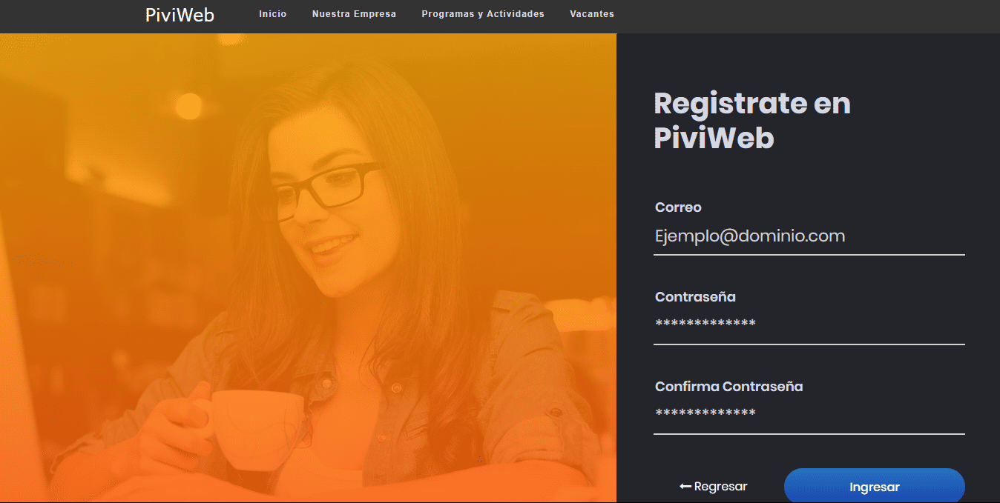
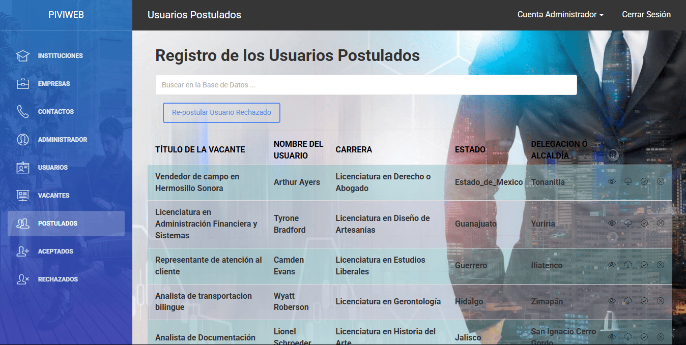
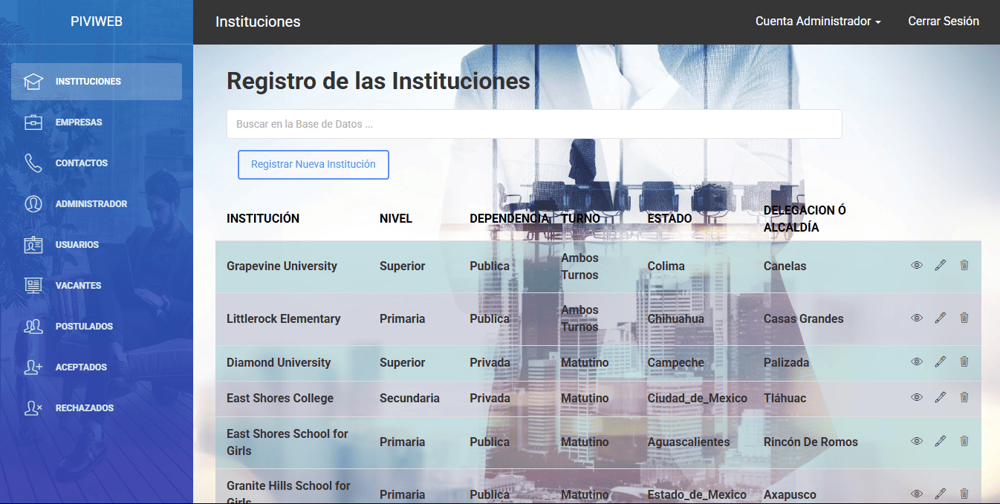

# Plataforma Interactiva de Vinculación Institucional

Como parte del proyecto de residencias profesionales de la carrera de Ingeniería en Sistemas Computacionales en el Instituto Tecnológico de Iztapalapa, se ha llevado a cabo el diseño e implementación de un sitio web para el Centro Nacional de Investigación y Desarrollo de Empresas S.C. (CENIDE). Esta organización se dedica a la vinculación de instituciones de enseñanza media superior y superior con el sector empresarial, con el objetivo de facilitar a los estudiantes la realización de residencias profesionales, servicio social o prácticas profesionales.

<p align="center">
  
</p>

El proyecto abarca los siguientes componentes:

Apartado General: Se encarga de la difusión de los diversos servicios que ofrece tanto el sitio web como la institución, incluyendo consultorías.

<p align="center">
  
</p>

Vacantes: Un apartado específico donde se publican las vacantes demandadas y ofertadas por las empresas o instituciones afiliadas.

<p align="center">
  
</p>

Registro e Ingreso de Usuarios: Un módulo que permite a los usuarios registrarse o ingresar al sitio para acceder a los servicios ofrecidos.

<p align="center">
  
</p>

Administración: Una sección destinada al personal de CENIDE para gestionar toda la información y las actividades realizadas en el sitio web.

<p align="center">
  
</p>

Además, el proyecto incluye la implementación de una base de datos que se encarga de almacenar y resguardar toda la información generada por el sitio web, asegurando su integridad y disponibilidad.

<p align="center">
  
</p>

**Consulta la versión preliminar del proyecto aquí:** [https://plataforma_web.com](https://www.alejandrovillegas.dev/projects/titling-project/index.html)

# 📌 Información del Proyecto

Este proyecto ha sido desarrollado como parte del portafolio de soluciones tecnológicas, con el objetivo de ofrecer una herramienta eficiente y funcional para usuarios autodidactas interesados en la gestión y desarrollo de proyectos web.

- **Área**: Desarrollo de Proyectos Web

- **Usuario Final**: Autodidactas y Desarrolladores

- **Fecha de Desarrollo**: 17 de enero de 2020

- **Portafolio de Proyectos**: [www.alejandrovillegas.dev](https://www.alejandrovillegas.dev)

# Guía de Instalación y Configuración del Proyecto

## 🖥️ Requisitos del Sistema

Para ejecutar este proyecto de manera local, es necesario contar con un entorno de desarrollo que incluya Apache, MySQL y PHP. Se recomienda el uso de **XAMPP**, ya que fue el entorno con el que se desarrolló el proyecto. Sin embargo, también es compatible con:

- **XAMPP** (Windows, macOS, Linux)

- **WAMP** (Windows)

- **MAMP** (macOS, Windows)

- **LAMP** (Linux)

## 🔧 Instalación y Configuración del Proyecto

Siga los pasos según el entorno de desarrollo que esté utilizando:

### Para XAMPP (Recomendado)

1. Descargue y descomprima el archivo del proyecto en su sistema local.

2. Copie la carpeta del proyecto y colóquela en el directorio **_htdocs_** dentro de la carpeta de instalación de XAMPP (Ejemplo: **C:\xampp\htdocs\mi_proyecto**).

### Para WAMP

1. Descargue y descomprima el archivo del proyecto.

2. Copie la carpeta del proyecto y colóquela en el directorio **_www_** dentro de la carpeta de instalación de WAMP (Ejemplo: **C:\wamp64\www\mi_proyecto**).

### Para MAMP

1. Descargue y descomprima el archivo del proyecto.

2. Copie la carpeta del proyecto y colóquela en el directorio **_htdocs_** dentro de la carpeta de instalación de MAMP (Ejemplo: **/Applications/MAMP/htdocs/mi_proyecto**).

### Para LAMP

1. Descargue y descomprima el archivo del proyecto.

2. Mueva la carpeta del proyecto a **_/var/www/html/_** utilizando el siguiente comando en la terminal:

```
sudo mv mi_proyecto /var/www/html/
```

## 🗄️ Configuración de la Base de Datos

### Para XAMPP, WAMP y MAMP

1. Inicie su entorno de desarrollo y asegúrese de que **Apache** y **MySQL** estén en ejecución.

2. Abra su navegador y acceda a **_phpMyAdmin_** ingresando:

- **XAMPP**: http://localhost/phpmyadmin

- **WAMP**: http://localhost/phpmyadmin

- **MAMP**: http://localhost:8888/phpmyadmin

3. Diríjase a la pestaña **SQL** e ingrese el siguiente código para crear la base de datos:

```
CREATE DATABASE piviwnwi_piviweb;
```

4. Vaya a la pestaña Importar y seleccione el archivo **_DataBase.sql_** del repositorio para importar la estructura y los datos.

### Para LAMP

1. Abra la terminal y acceda a MySQL con:

```
mysql -u root -p
```

2. Cree la base de datos ejecutando:

```
CREATE DATABASE piviwnwi_piviweb;
```

3. Salga de MySQL y luego importe la base de datos con:

```
mysql -u root -p piviwnwi_piviweb < /ruta/del/archivo/DataBase.sql
```

Reemplace **_/ruta/del/archivo/_** con la ubicación real del archivo en su sistema.

## 🌟 Creación de Vistas en la Base de Datos

Después de crear e importar la base de datos, ejecute el siguiente código en **phpMyAdmin** (pestaña SQL) o directamente en MySQL para generar las vistas necesarias:

```
CREATE VIEW usuario_administrador AS
SELECT
datos_usuario.Fecha_DUsuario,
usuarios.IDUsuario,
datos_usuario.IDDUsuario,
datos_usuario.Nombre_DUsuario,
datos_usuario.Correo_DUsuario,
usuarios.Contrasena_Usuario,
datos_usuario.Edad_DUsuario,
datos_usuario.Nivel_DUsuario,
datos_usuario.Carrera_DUsuario,
datos_usuario.Conocimiento_DUsuario,
datos_usuario.Telefono_DUsuario,
datos_usuario.Ciudad_DUsuario,
datos_usuario.Minicipio_DUsuario,
datos_usuario.TVacante_DUsuario
FROM usuarios
INNER JOIN datos_usuario
ON datos_usuario.Correo_DUsuario = usuarios.Correo_Usuario
ORDER BY usuarios.Correo_Usuario;

CREATE VIEW postulados_administrador AS SELECT
    archivos.id,
    archivos.titulo,
    vacante.Emp_Inst_Vacantes,
    datos_usuario.Nombre_DUsuario,
    archivos.correo,
    datos_usuario.Edad_DUsuario,
    datos_usuario.Nivel_DUsuario,
    datos_usuario.Carrera_DUsuario,
    datos_usuario.Conocimiento_DUsuario,
    datos_usuario.Telefono_DUsuario,
    datos_usuario.Ciudad_DUsuario,
    datos_usuario.Minicipio_DUsuario,
    datos_usuario.TVacante_DUsuario,
    archivos.direccion,
    archivos.fecha
FROM
    archivos
INNER JOIN datos_usuario ON datos_usuario.Correo_DUsuario = archivos.correo
INNER JOIN vacante ON vacante.Titulos_Vacantes = archivos.titulo
ORDER BY
    archivos.id;

CREATE VIEW postulados_aceptados_administrador AS SELECT
    postulados_aceptados.IDUPAceptados,
    postulados_aceptados.Titulo_UPAceptados,
    vacante.Emp_Inst_Vacantes,
    datos_usuario.Nombre_DUsuario,
    postulados_aceptados.Correo_UPAceptados,
    datos_usuario.Edad_DUsuario,
    datos_usuario.Nivel_DUsuario,
    datos_usuario.Carrera_DUsuario,
    datos_usuario.Conocimiento_DUsuario,
    datos_usuario.Telefono_DUsuario,
    datos_usuario.Ciudad_DUsuario,
    datos_usuario.Minicipio_DUsuario,
    postulados_aceptados.Direccion_UPAceptados,
    postulados_aceptados.Fecha_UPAceptados,
    postulados_aceptados.Reporte_UPAceptados,
    datos_usuario.TVacante_DUsuario
FROM
    postulados_aceptados
INNER JOIN datos_usuario ON datos_usuario.Correo_DUsuario = postulados_aceptados.Correo_UPAceptados
INNER JOIN vacante ON vacante.Titulos_Vacantes = postulados_aceptados.Titulo_UPAceptados
ORDER BY
    postulados_aceptados.IDUPAceptados;

CREATE VIEW postulados_rechazados_administrador AS SELECT
    postulados_rechazados.IDUPAceptados,
    postulados_rechazados.Titulo_UPRechazados,
    vacante.Emp_Inst_Vacantes,
    datos_usuario.Nombre_DUsuario,
    postulados_rechazados.Correo_UPRechazados,
    datos_usuario.Edad_DUsuario,
    datos_usuario.Nivel_DUsuario,
    datos_usuario.Carrera_DUsuario,
    datos_usuario.Conocimiento_DUsuario,
    datos_usuario.Telefono_DUsuario,
    datos_usuario.Ciudad_DUsuario,
    datos_usuario.Minicipio_DUsuario,
    postulados_rechazados.Direccion_UPRechazados,
    postulados_rechazados.Fecha_UPRechazados,
    postulados_rechazados.Reporte_UPRechazados,
    datos_usuario.TVacante_DUsuario
FROM
    postulados_rechazados
INNER JOIN datos_usuario ON datos_usuario.Correo_DUsuario = postulados_rechazados.Correo_UPRechazados
INNER JOIN vacante ON vacante.Titulos_Vacantes = postulados_rechazados.Titulo_UPRechazados
ORDER BY
    postulados_rechazados.IDUPAceptados;
```

## 🚀 Ejecución del Proyecto

1. Inicie su entorno de desarrollo:

- **XAMPP**: Abra el "Panel de Control de XAMPP" y active **Apache** y **MySQL**.

- **WAMP**: Haga clic en el icono de WAMP y active los servicios.

- **MAMP**: Abra MAMP y haga clic en **Start Servers**.

- **LAMP**: Ejecute los siguientes comandos en la terminal:

```
sudo systemctl start apache2
sudo systemctl start mysql
```

2. Abra un navegador e ingrese la siguiente URL según el entorno:

- **XAMPP / WAMP**: **_http://localhost/_**

- **MAMP**: **_http://localhost:8888/_**

- **LAMP**: **_http://localhost/_**

El proyecto ahora está funcionando en su entorno local. 🎉

## 🔑 Credenciales de Acceso

### 🛠️ Detalles de Inicio de Sesión para Administrador

- Nombre de usuario: **_administrador01@piviweb.com_**

- Contraseña: **_12345_**

### 👤 Detalles de Inicio de Sesión para Usuario Preregistrado

- Nombre de usuario: **_usuario01@piviweb.com_**

- Contraseña: **_12345_**

Tambien puede **registrar un nuevo usuario** desde la interfaz de la aplicación.
